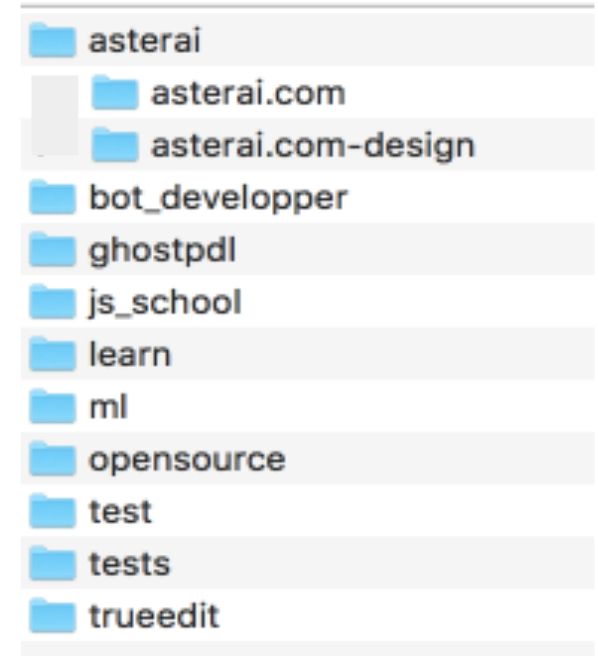

# Задание 2.Наполнить дерево папок поведением.

1. Используя события JS реализуйте collaps/expand дерева из первого задания.
2. Сделайте возможность выделять 1 item.
3. Сделайте возможность через shift выбрать много файлов. 

