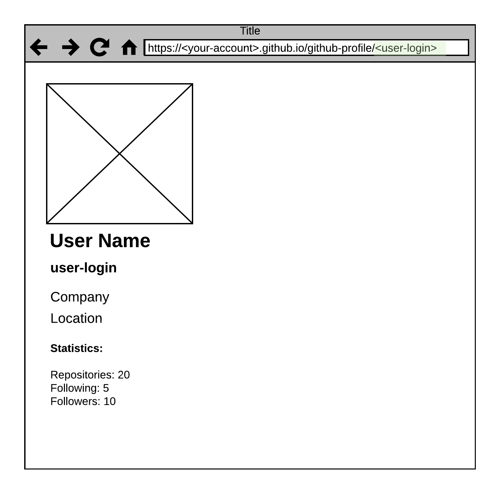

# Задание 7. Профиль GitHub-пользователя

Необходимо написать приложение, отображающе краткие сведения о пользователе
GitHub.

1. Имя пользователя указано в адресе страницы

2. Информация, которую необходимо показать:
   * Фотография
   * Имя (и Фамилия) Пользователя
   * Компания
   * Локация
   * Статистика (Кол-во репозиториев, кол-во подписок на
   других пользователей, кол-во подписок на этого пользователя)

3. Данные о `github`-пользователе получить:
   * с помощью функции `fetch`
   * по адресу: `https://api.github.com/users/:user-login`

Для решения задачи рекомендуется создать отдельный репозиторий.

Макет для страницы приложения:

Дополнительные материалы:

1. [Про цикл событий в JavaScript или "как на самом деле работает асинхронность"?](https://www.youtube.com/watch?v=8cV4ZvHXQL4) (видео)

1. [Параллельная модель и цикл событий.](https://developer.mozilla.org/ru/docs/Web/JavaScript/EventLoop)

1. `Callback Queue` на примере `EventEmitter`: [https://codesandbox.io/s/vjxljn1295](https://codesandbox.io/s/vjxljn1295)

1. `Callback`-и на примере `loadImage`: [https://codesandbox.io/s/7ymw3rk9lx](https://codesandbox.io/s/7ymw3rk9lx)

1. `Promise`-ы на примере `showUserAvatar`: [https://codesandbox.io/s/0mz08yv45p](https://codesandbox.io/s/0mz08yv45p)

1. `Promise`-ы на примере `delay` и `timeout` [https://codesandbox.io/s/7qrzxyp2j](https://codesandbox.io/s/7qrzxyp2j)

1. Приоритеты `EventLoop`: [https://codesandbox.io/s/xlm4p718x4](https://codesandbox.io/s/xlm4p718x4)

1. [Иллюстрация `EventLoop`](../assets/event-loop.pdf)

