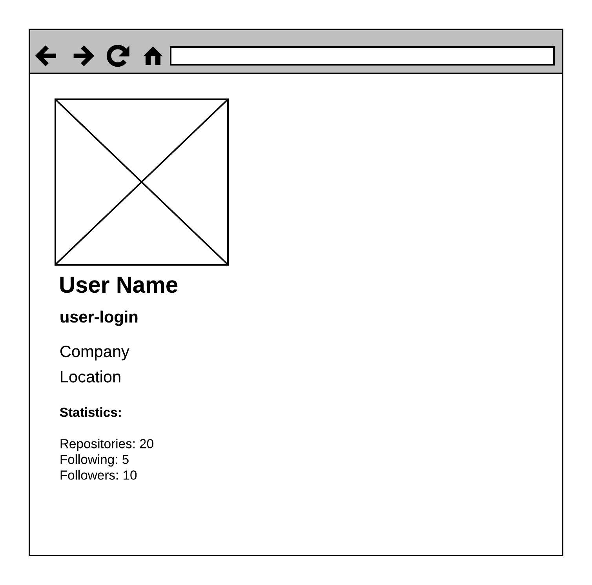

# `React`-Приложение "Профиль GitHub-пользователя"

Используя бойлерплэйт `create-react-app` создайте `React`-приложение, которое из
статического `json`-файла будет рендерить Профиль гитхаб-пользователя:



Получить статический `json`-файл с данными пользователя можно вот так:

```sh
curl https://api.github.com/users/[YOUR-GITHUB-USERNAME] > ./src/user.json
```

Для оформления использовать один из `css`-фреймворков: [bootstrap](https://getbootstrap.com/) или [Material UI](https://material-ui.com/), который подключить через CDN.