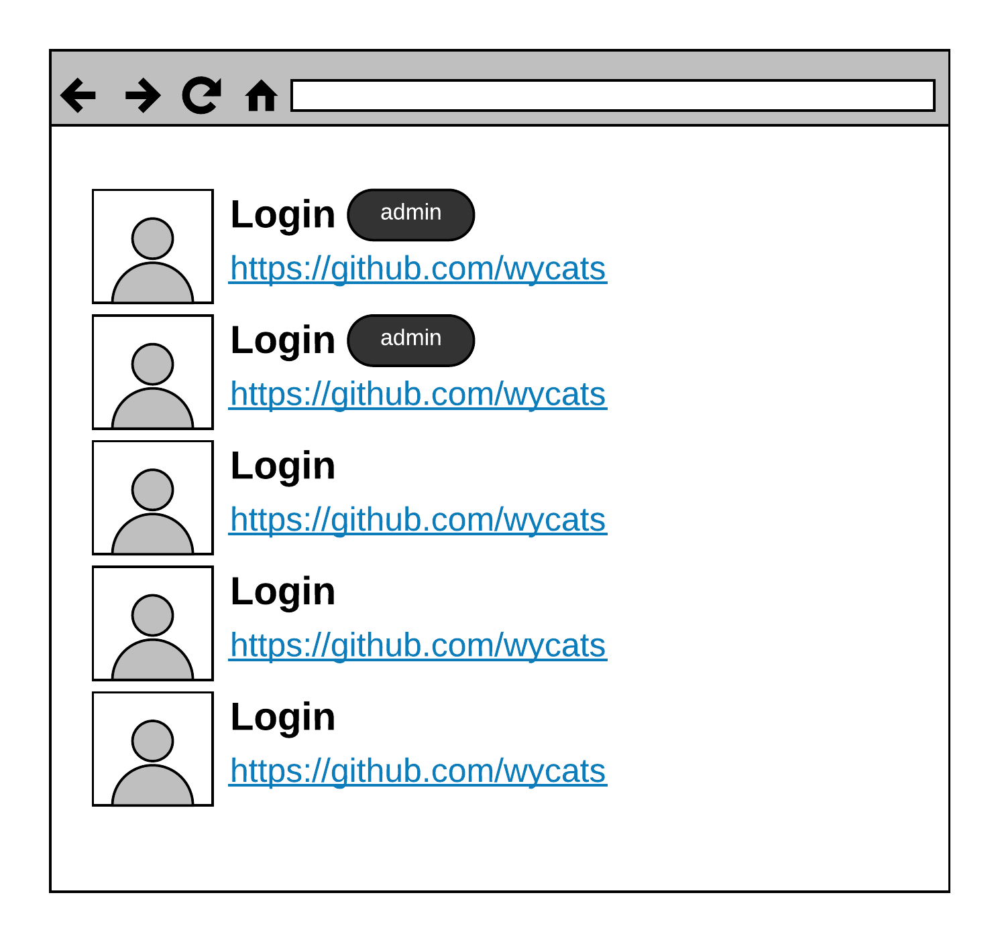

# `React`-Приложение "Список GitHub-пользователей"

Используя бойлерплэйт `create-react-app` создайте `React`-приложение, которое из
статического `json`-файла будет рендерить Список **github**-пользователя:



Получить статический `json`-файл с данными пользователя можно вот так:

```sh
curl https://api.github.com/users?since=0 > ./src/users.json
```

Для оформления использовать один из `css`-фреймворков: [bootstrap](https://getbootstrap.com/) или [Material UI](https://material-ui.com/), который подключить через CDN.