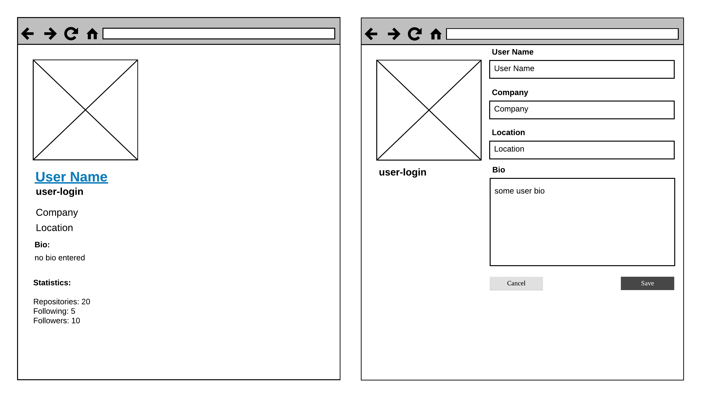

# `React`-Приложение "Профиль GitHub-пользователя": загрузка, редактирование, сохранение

Добавьте в `React`-приложение, созданное в рамках задачи 
[Профиль GitHub-пользователя (статический рендер)](./01-1-static-render.md),
следующую функциональность:

1. Загрузка данных пользователя с `github`-сервера
2. Редактирование данных пользователя
3. Сохранение данных пользователя на `github`-серевре

## Мокап приложения с учетом редактирования

## Советы:
1. Создайте нового fake-ого пользователя на `github`
2. Создайте персональный токен с полномочиями для изменения данных пользователя
3. Поместите данные пользователя в конфигурационный файл (запуште на `github`)

## Ссылки:

1. [API-спецификация](https://developer.github.com/v3/users/#update-the-authenticated-user)
2. [Аутентификация запросов](https://developer.github.com/v3/#authentication)
3. [Fetch API](https://developer.mozilla.org/ru/docs/Web/API/Fetch_API)