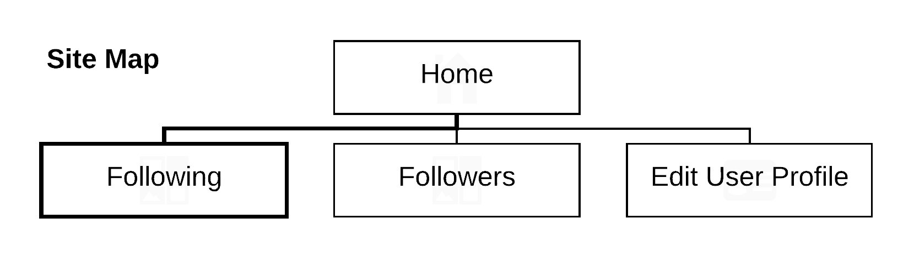
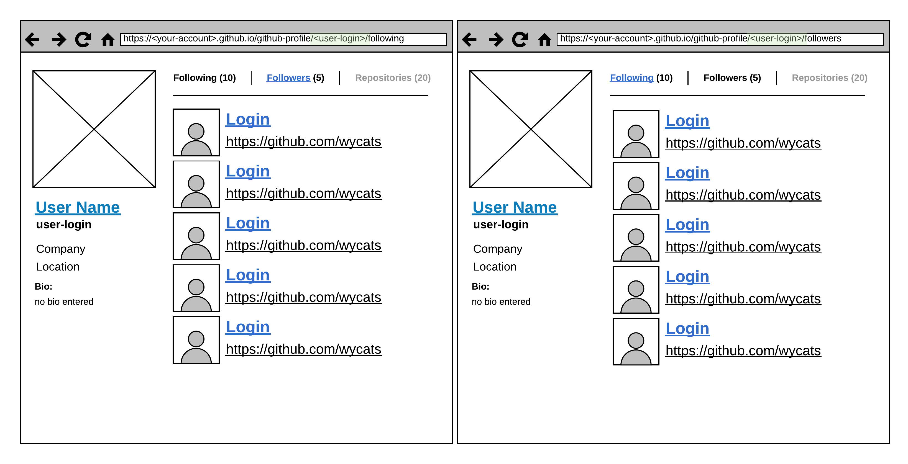
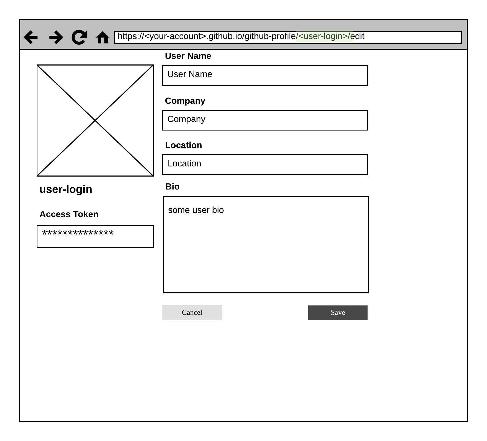

# `React`-приложение "Менеджер GitHub-пользователей"

Разработать (по возможности использовать код из предыдущих задач) `React`-приложение со следующей функциональностью:

1. Отображение информации о выбранном пользователе
1. Отображение списка пользователей, на которых подписан выбранный пользователь
1. Отображение списка пользователей, которые подписаны на выбранного пользователя
1. Переходы по ссылкам из списка пользователей:
   - при клике на логин - выбор пользователя
   - при клике на ссылку на гитхаб - переход на гитхаб
1. Редактирование профиля выбранного пользователя (запросить токен)

Все переходы по раутам приложения должны происходить без перезагрузки страницы.
Ссылка на любой раут должна открываться при вводе ее в строку браузера.

## Карта сайта:

## Основная страница

1. `/<user-login>/following`
1. `/<user-login>/followers`

## Редактирование профиля пользователя

`/<user-login>/edit`

### Deploy SPA at `github`-pages:

https://gist.github.com/DScheglov/2a3f8a0dbefd000978a8ab75c2911f1d