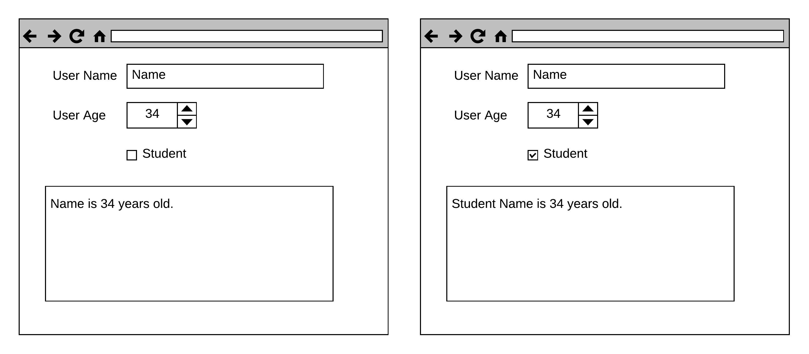

# Приложение `Redux`-форма "Форма Пользователя"

Необходимо разработать приложение "Форма Пользователя" с использованием библиотек `react` и `redux`.

За основу взять [Репозиторий](https://github.com/pdffiller/js-school-redux-basics-tmpl).

При решении задачи необходимо:
1. Объявить один или несколько типов `action`-ов
2. Создать соответствующие `actionCreator`'ы
3. Создать один редьюсер
4. Создать хранилище (`store`)
5. Подключить хранилище к Приложению с помощью `Provider`
6. Подключить `React`-компоненты к состоянию `Redux`-хранилища

Мокап приложения (представление одно, просто выглядит по-разному в
зависимости от введенных данныхы):

