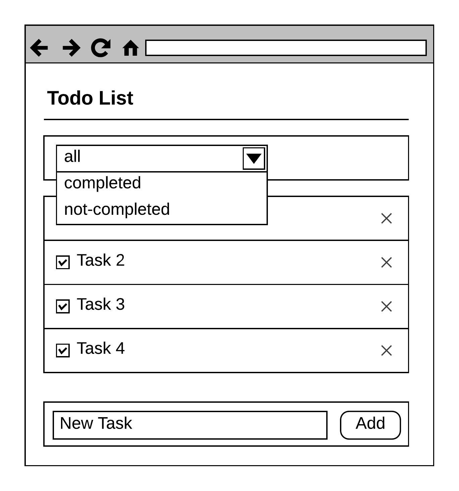
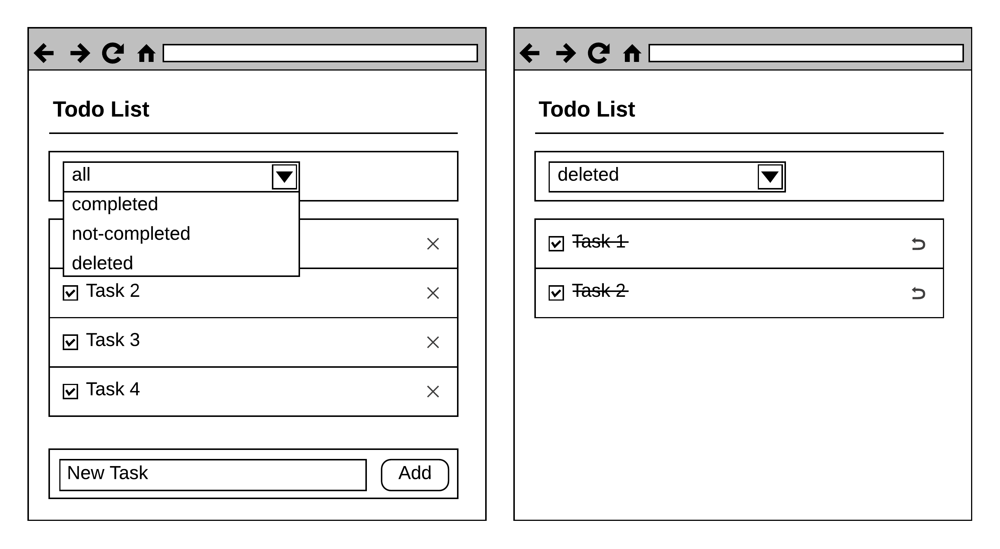

# `React/Redux`-приложение "Список дел"

Необходимо доработать приложние "Список дел", добавив следующую функциональность:

1. Добавление Задачи в список (при добавлении задачи статус завершенности берется
   из фильтра)
2. Удаление Задачи из списка

При решении задачи использовать репозиторий: https://github.com/pdffiller/js-react-school-todolist

В репозитории удалены `id` задач в началном значении "Списка дел".
Это приводит к "падению" приложения.

В данную задачу также входит "починить" приложение, не добавляя `id`
в начальный "Список дел".

Мокап-приложения:

## Дополнительное задание (+3 балла)

Реализовать возможность восстановления удаленных задач:

